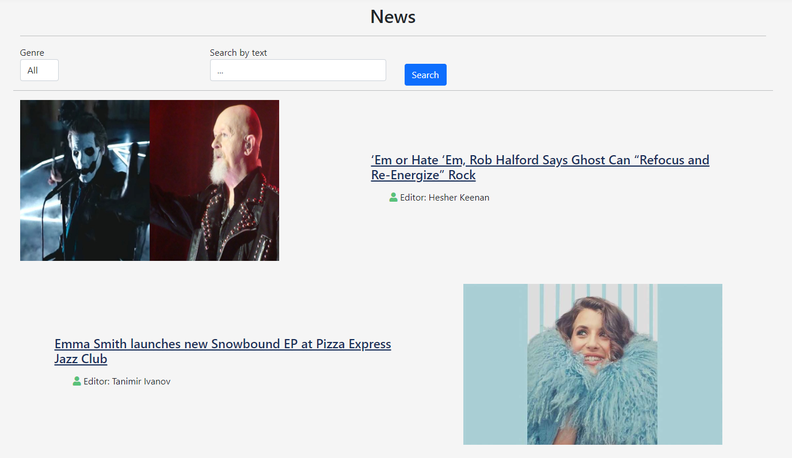
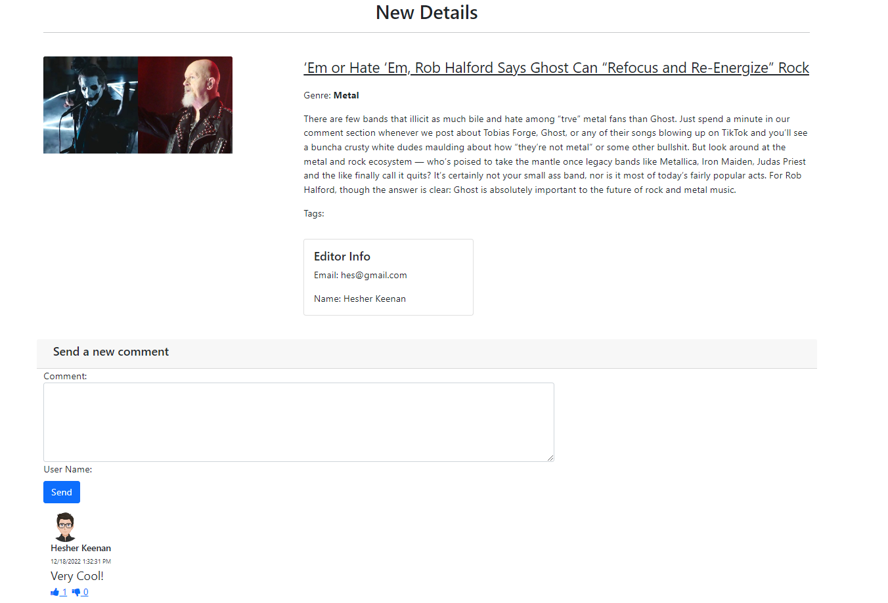
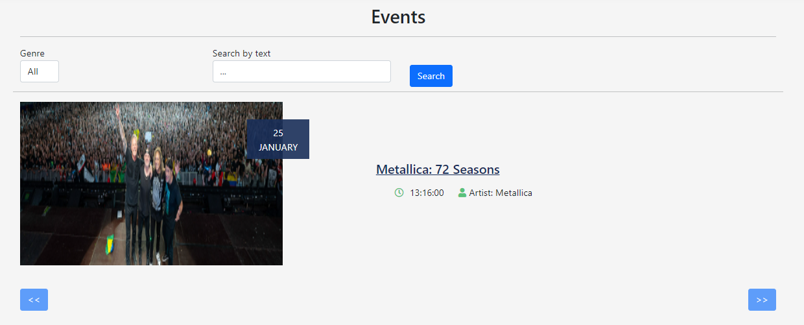
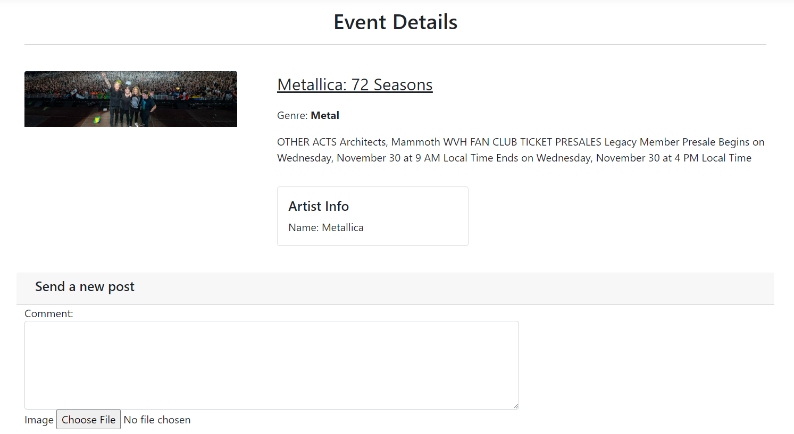

# MusiCom

This project is a web application which purpose is to present music news and events from various genres that are taking place in the music world. Users can comment on both, sharing their feelings and opinions. This project was assigned to me by SoftUni at the end of the final module. Its purpose was to test whether I have gained the required knowledge in order to develop a functioning web app. The theme of the course was Web Development with ASP.NET Core MVC framework.

## News

## Events

